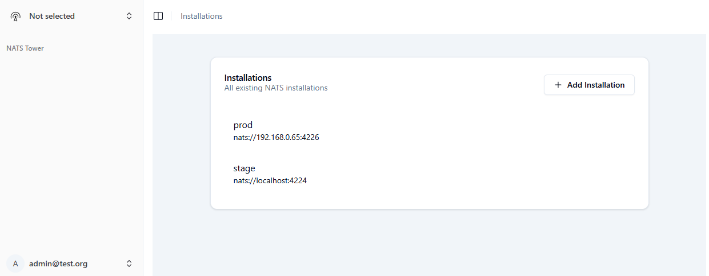
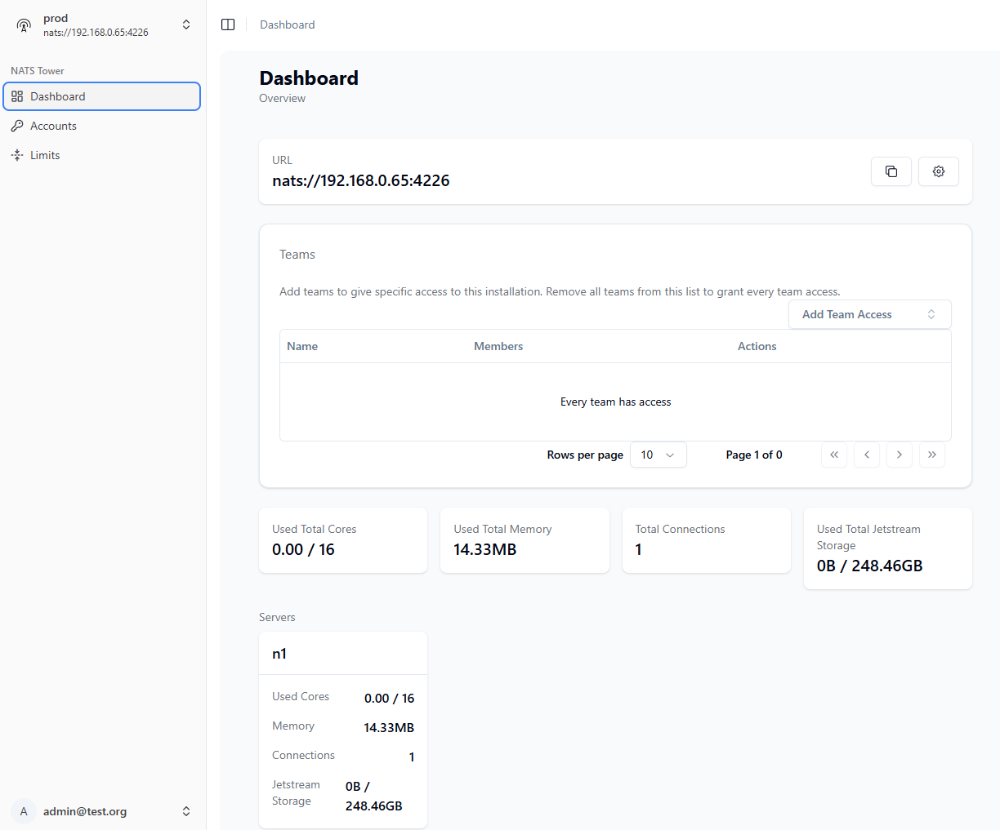
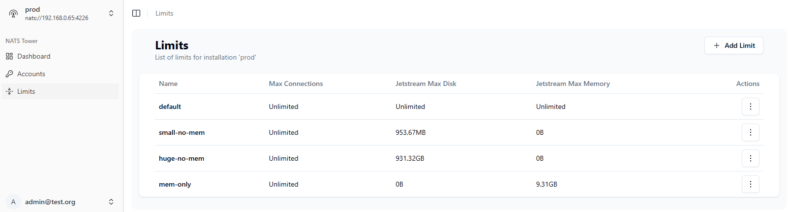
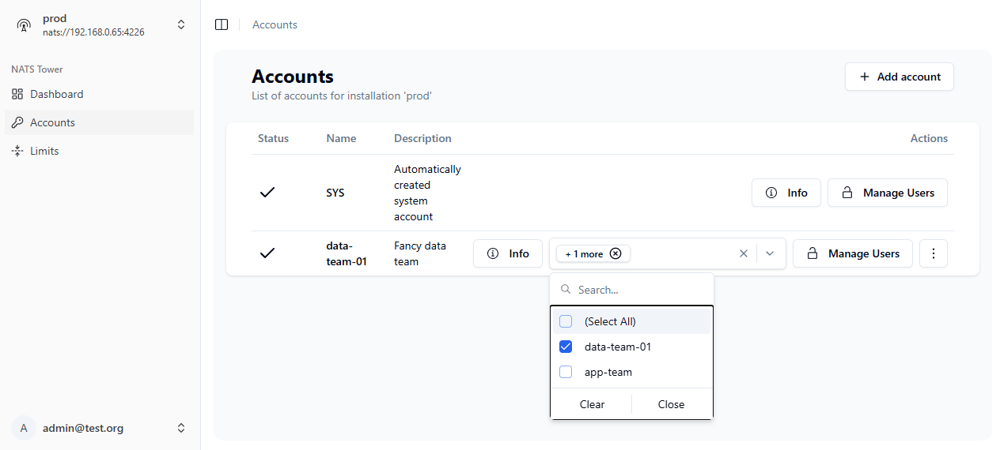
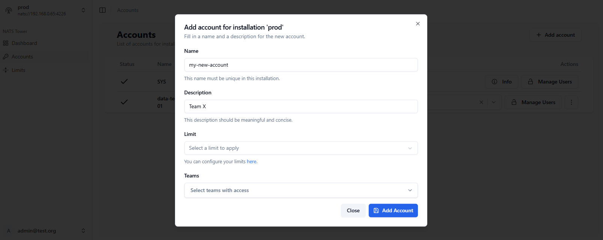
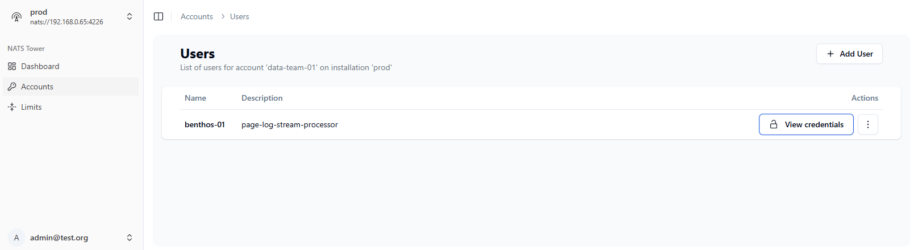
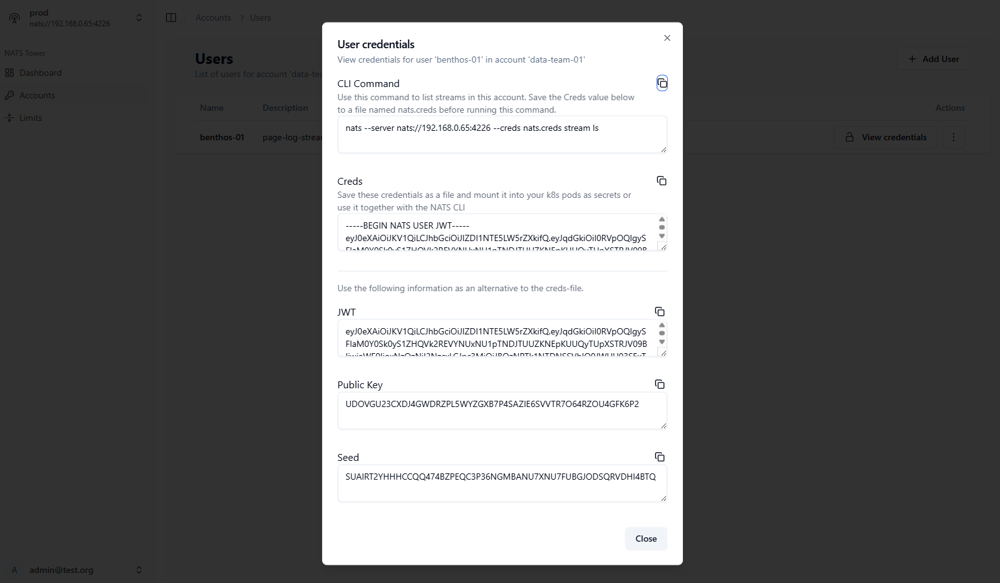

# NATS Tower

NATS Tower is a simple multi tenant manager for NATS. It allows you to create tenants / accounts, manage users and manage permissions for those users.

> Still work in progress, but it should do what it is supposed to :)  
> See [https://nats-tower.com](https://nats-tower.com) for more information

## Demo instance

You can try out NATS Tower on the demo instance: [https://demo.nats-tower.com](https://demo.nats-tower.com).  
You can login with GitHub or with one of the following credentials:
- **Username**: `app-demo@nats-tower.com`
- **Password**: `nats-tower`
- **Username**: `data-demo@nats-tower.com`
- **Password**: `nats-tower`

You gain access to different NATS accounts if you use the different credentials. The demo instance is limited and will be reset regularly. Do not use it for production workloads. Any user data will be wiped in that process as well.

You will only be able to access the demo instance as a "user" and not as an "admin". This means you will not be able to create new users or accounts. You can only manage your own account.

## Motivation

As hosting NATS is "simple" and more and more applications hop on to NATS, it is getting more and more important to have a good way to manage tenants and users. NATS Tower aims to be a simple solution to this problem.

Starting off with basic username / password authentication, it soon becomes harder to manage subject collisions and resource usages. NATS Tower is here to help you with that.

NATS Tower uses the decentralized JWT authentication to authenticate users and therefore requires your NATS Servers to run in [Operator mode](https://docs.nats.io/running-a-nats-service/configuration/securing_nats/auth_intro/jwt).

### Use cases

#### Multiple Teams

Requirements:

- You have multiple teams that should not be able to see each others messages and communicate via specific imports/exports
- The teams should move fast and should be able to create new subjects, streams and users on their own
- The teams should have a limited set of resources

In this cases each team will get their own account with appropriate resources. In their account they can create users and manage subjects & streams as they please.

#### Single User with several applications

You are a lonely developer with no friends and multiple applications to manage. You want to have a single NATS Server that you can use for all your applications, but you want to make sure that they don't interfere with each other.

Each application can get its own account and you can manage the resources, streams and subjects for each application separately.

## Features

- Multi tenant
- User management
- Permission management
- Resource management
- Web based UI
- k8s operator (soon)

## UI screenshots

## Getting started

To get started with NATS Tower, you can either run it as a standalone application or deploy it to your container runtime of choice. You can find detailed instructions in the [documentation](https://nats-tower.github.io/nats-tower/).

`docker run -p 8099:8099 ghcr.io/nats-tower/nats-tower:main serve --http 0.0.0.0:8099`

Next, open your browser and navigate to [http://localhost:8099](http://localhost:8099) to access the NATS Tower interface.

> The default admin is `admin@test.org` and the default password is `testtest`.

Navigate to the `http://localhost:8099/_/` to access the admin interface.

Default user credentials:
    
- The default user is `user@test.org` and the default password is `testtest`.

## Acknowledgements

- [Pocketbase](https://pocketbase.io/) for the awesome base
- [NATS](https://nats.io/) for the awesome messaging system
- [Synadia](https://synadia.com/) for maintaining NATS and the NATS ecosystem (check out their managed NATS offering! or use NATS Tower ;))

## Contributing

If you want to contribute to NATS Tower, please fork the repository and create a pull request. We welcome any contributions, whether it's bug fixes, new features or documentation improvements.

Also, please feel free to open issues for any bugs or feature requests you may have. We will do our best to address them in a timely manner. Thank you for your interest in contributing!
