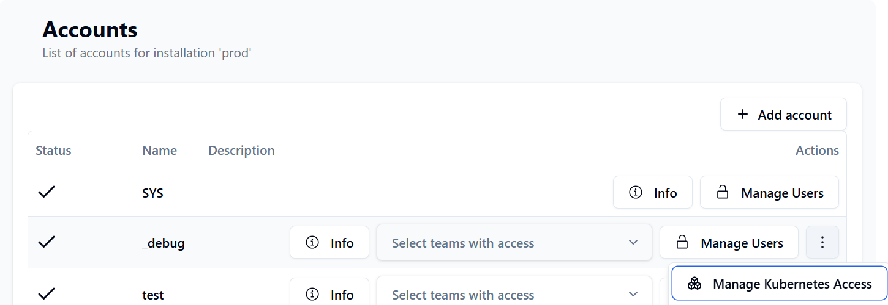
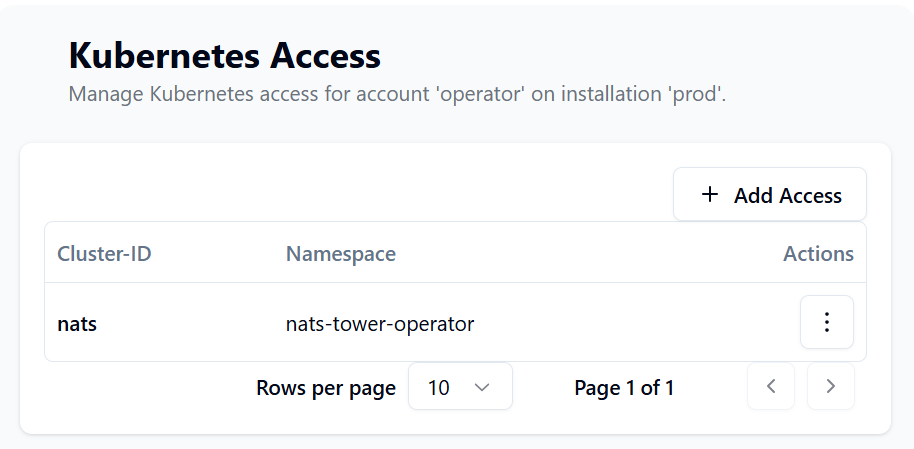
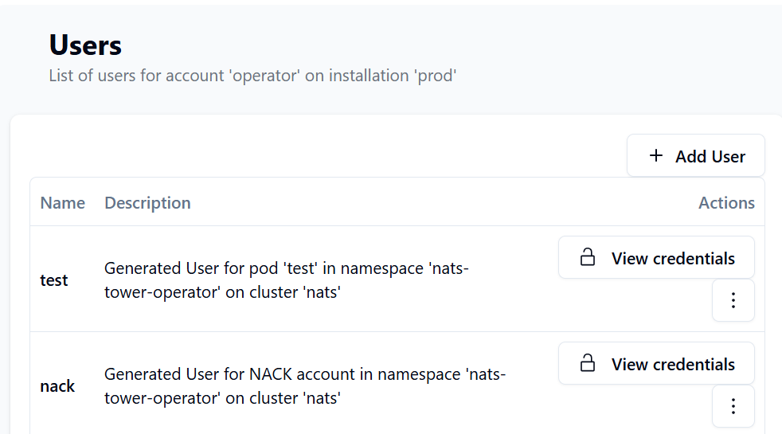

# Kubernetes Integration

The NATS Tower Kubernetes Operator is a Kubernetes operator that manages the lifecycle of credentials for NATS installations that are managed by NATS Tower in a Kubernetes cluster.

Imagine the following scenario: you have a NATS installation that is managed by NATS Tower, and you want to use this NATS installation in your Kubernetes cluster. You can use the NATS Tower Operator to automatically provision the necessary credentials for your NATS installation in Kubernetes, so you can use it in your applications without having to manually manage the credentials.

## How it works

### Pre-requisites

Please install the [NACK operator](https://github.com/nats-io/nack) CRDs and operator to manage NATS resources (Streams, KV-buckets, etc.) automatically.

### Authentication

The NATS Tower Operator uses the NATS Tower API to authenticate with the NATS Tower service. It uses the `NATS_TOWER_URL` and `NATS_TOWER_API_TOKEN` environment variables to connect to the NATS Tower service. `NATS_TOWER_API_TOKEN` is a shared secret that has to match the `API_TOKEN` of the NATS Tower installation you want to connect to.
The operator will use the `NATS_TOWER_CLUSTER_ID` to identify the kubernetes cluster it is running on. (e.g. `backend-prod-k8s-cluster`)

> The operator may be installed as a cluster scoped or namespaced operator. If you want to use the operator in a namespaced installation, you have to set the `NATS_TOWER_NAMESPACE` environment variable to the namespace where the operator is running. This is required to ensure that the operator only operates on resources in that namespace.

### Configuration

To allow the operator to generate credentials for an Account in NATS Tower, you have to configure the account in the NATS Tower UI and link it to the Kubernetes cluster ID. You can do this by selecting the option in the account settings menu.



In that view, you can allow kubernetes clusters & namespaces to access the account. The operator will only be able to create credentials for accounts that have the correct cluster ID and namespace configured. This will give account owners the ability to control which kubernetes clusters and namespaces can access their NATS accounts.



### Usage

The NATS Tower Operator watches for changes on the following resources:

- `v1/pods`
  - Required labels:
    - `nats-tower.com/nats-tower-account`: The name of the NATS account in NATS Tower that the pod should use to connect to the NATS installation.
    - `nats-tower.com/nats-tower-secret`: The name of the secret that should contain the NATS credentials.
  - Optional labels:
    - `nats-tower.com/nats-tower-installation`: The public key of the NATS installation in NATS Tower. You can copy this from the NATS Tower UI. Only required if you did not specify the `NATS_TOWER_DEFAULT_INSTALLATION` environment variable in the operator deployment.
- `jetstream.nats.io/v1beta2/accounts`
  - Required labels:
    - `nats-tower.com/nats-tower-secret`: The name of the secret that should contain the NATS credentials.
  - Optional labels:
    - `nats-tower.com/nats-tower-installation`: The public key of the NATS installation in NATS Tower. You can copy this from the NATS Tower UI. Only required if you did not specify the `NATS_TOWER_DEFAULT_INSTALLATION` environment variable in the operator deployment.

As soon as the operator detects a change on one of these resources, it will create or update the secret with the NATS credentials in the same namespace as the resource. The secret will be named according to the value of the `nats-tower.com/nats-tower-secret` label.

NATS Users will be visible under the account in NATS Tower like this:



### Examples

#### Pod with NATS credentials

```yaml
apiVersion: v1
kind: Pod
metadata:
  name: test
  labels:
    # can be omitted, if the operator has the default installation config set
    nats-tower.com/nats-tower-installation: OC7OMSNNKRRZ3AQ3ZMBMYVDPBDI5UMFMZVJ6H4V5PNUUSM5UAB6BZFIT
    # must match the account name in NATS Tower, this account has to be linked to the kubernetes cluster id via the NATS Tower Operator
    nats-tower.com/nats-tower-account: operator
    # will be used to create a secret with the NATS credentials
    nats-tower.com/nats-tower-secret: mycreds
spec:
  containers:
    - name: web
      image: nginx
      ports:
        - name: web
          containerPort: 80
          protocol: TCP
      volumeMounts:
      - name: creds
        # this will result in a file /creds/nats.creds
        # with the contents of the secret
        mountPath: /creds
  volumes:
  - name: creds
    secret:
      secretName: mycreds
```

#### Account with NATS credentials

```yaml
---
apiVersion: jetstream.nats.io/v1beta2
kind: Account
metadata:
  name: operator
  labels:
    # can be omitted, if the operator has the default installation config set
    nats-tower.com/nats-tower-installation: OC7OMSNNKRRZ3AQ3ZMBMYVDPBDI5UMFMZVJ6H4V5PNUUSM5UAB6BZFIT
    nats-tower.com/nats-tower-secret: nack
spec:
  name: operator
  servers:
    - nats://nats:4222
  creds:
    secret:
      name: nack
    file: nats.creds
```

This will allow to use this NACK resource to be referenced by other NACK resources, such as Streams or KV-buckets.

## Installation

The NATS Tower Operator is available as a docker image on [ghcr.io](https://github.com/nats-tower/nats-tower-operator/pkgs/container/nats-tower-operator).

Please check the [release page](https://github.com/nats-tower/nats-tower-operator/releases) for the latest version.

The operator manifests are available as kustomize overlays in the `deployment` folder. 

There are overlays for namespaced and cluster scoped installations.

### Namespaced scoped installation

Create a `kustomization.yaml` file containing the following:

```yaml
resources:
- https://github.com/nats-tower/nats-tower-operator//deployment/kustomize/?timeout=120&ref=<PUT LATEST TAG HERE>
- https://github.com/nats-tower/nats-tower-operator//deployment/kustomize/namespaced/?timeout=120&ref=<PUT LATEST TAG HERE>

namespace: <PUT YOUR NAMESPACE HERE>

configMapGenerator:
- name: nats-tower-operator-config
  behavior: merge
  literals:
    - NATS_TOWER_NAMESPACE=<PUT YOUR NAMESPACE HERE>
    - NATS_TOWER_URL=<PUT YOUR NATS TOWER URL HERE, e.g. https://tower.example.com>
    - NATS_TOWER_CLUSTER_ID=<PUT YOUR CLUSTER ID HERE, e.g. backend-prod-k8s-cluster>
    - NATS_TOWER_DEFAULT_INSTALLATION=<PUT YOUR INSTALLATION IDENTIFIER HERE, e.g. OC7OMSNNKRRZ3AQ3ZMBMYVDPBDI5UMFMZVJ6H4V5PNUUSM5UAB6BZFIT>
    - |
      installations.yaml=<PUT YOUR INSTALLATION IDENTIFIER HERE, e.g. OC7OMSNNKRRZ3AQ3ZMBMYVDPBDI5UMFMZVJ6H4V5PNUUSM5UAB6BZFIT>: {}
```

> `NATS_TOWER_DEFAULT_INSTALLATION` is optional, but recommended. If set, the operator will use this installation as default for all resources that do not specify a specific installation. This is useful if you have a single NATS installation that you want to use for all resources in the namespace / cluster.

### Cluster scoped installation

Create a `kustomization.yaml` file containing the following:

```yaml
resources:
- https://github.com/nats-tower/nats-tower-operator//deployment/kustomize/?timeout=120&ref=<PUT LATEST TAG HERE>
- https://github.com/nats-tower/nats-tower-operator//deployment/kustomize/cluster/?timeout=120&ref=<PUT LATEST TAG HERE>

namespace: <PUT YOUR NAMESPACE HERE>

configMapGenerator:
- name: nats-tower-operator-config
  behavior: merge
  literals:
    - NATS_TOWER_URL=<PUT YOUR NATS TOWER URL HERE, e.g. https://tower.example.com>
    - NATS_TOWER_CLUSTER_ID=<PUT YOUR CLUSTER ID HERE, e.g. backend-prod-k8s-cluster>
    - NATS_TOWER_DEFAULT_INSTALLATION=<PUT YOUR INSTALLATION IDENTIFIER HERE, e.g. OC7OMSNNKRRZ3AQ3ZMBMYVDPBDI5UMFMZVJ6H4V5PNUUSM5UAB6BZFIT>
    - |
      installations.yaml=<PUT YOUR INSTALLATION IDENTIFIER HERE, e.g. OC7OMSNNKRRZ3AQ3ZMBMYVDPBDI5UMFMZVJ6H4V5PNUUSM5UAB6BZFIT>: {}
```

> `NATS_TOWER_DEFAULT_INSTALLATION` is optional, but recommended. If set, the operator will use this installation as default for all resources that do not specify a specific installation. This is useful if you have a single NATS installation that you want to use for all resources in the namespace / cluster.
